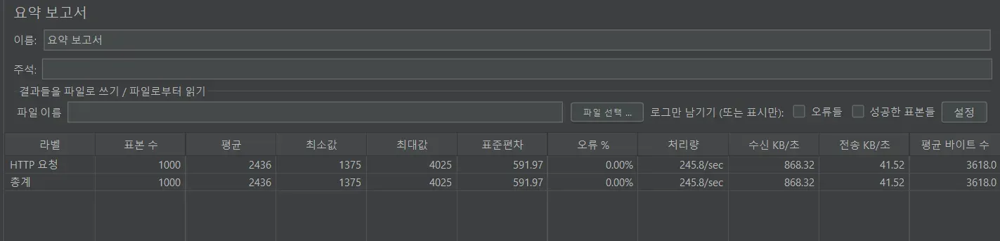
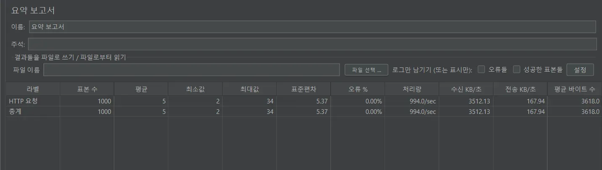
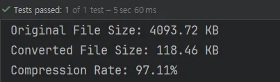
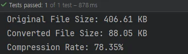
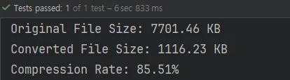

## 대규모 중고 경매 서비스 Berry Market

## 👨‍👩‍👧‍👦 Our Team

| 김성호<br>[@ksngh](https://github.com/ksngh) | 이현진<br>[@drinkgalaxy](https://github.com/drinkgalaxy) | 최소진<br>[@sonoopy](https://github.com/sonoopy) | 강희승<br>[@Hxxseung](https://github.com/Hxxseung) | 유현<br>[@yuhyun1](https://github.com/yuhyun1) |
|:-----------------------------------------:|:-----------------------------------------------------:|:---------------------------------------------:|:-----------------------------------------------:|:--------------------------------------------:|
|                  Bid<br>                  |                    Post<br>Review                     |          GateWay<br>Auth<br>Payment           |            Delivery<br>Notification             |            User<br>Report<br>Like            |
---
[📆 Team Notion 바로가기](https://sneaky-prawn-eed.notion.site/5-1681ee33c50580c58650d0b31c2f3696?pvs=4)<br>
---
## 1. 📖소개
- **실시간 경매** 기반 상품 거래 플랫폼 “베리 마켓”

- 베리 마켓은 **판매자**가 **상품을 등록**하고, **지정한 시간**에 **실시간 경매**가 진행되는 플랫폼입니다.

- 경매는 **채팅 기반**으로 이루어지며, **판매자**가 **지정한 시작가**에서 시작해 **가장 높은 금액**을 제시한 입찰자에게 **상품**이 **판매**됩니다.

## 2. 🎯프로젝트 핵심 목표

1️⃣  **MSA 아키텍처**
- 확장 가능성이 높고 대규모 트래픽 처리가 가능한 서비스 구축

2️⃣ **시스템 안정성**
- 안정적이고 빠른 서비스 제공을 위한 모니터링

3️⃣ **실시간성**
- 웹소켓을 활용한 실시간 경매
<br>

## 3. ✨주요 기능

### 1️⃣ **경매**
- 판매자가 경매할 물품을 등록하면 경매 게시글이 생성됨
- 경매 진행 기간이 시작되면 입찰 채팅방이 생성되고, 최종적으로 최고가를 부른 입찰자에게 상품이 낙찰됨
  - Kafka를 통해 여러 서비스들과의 비동기 통신 구현
  - 실시간 입찰 채팅을 위해 웹소켓 사용
  
### 2️⃣ **주문**
- 낙찰 후 결제 시 포인트를 차감하고 주문이 생성됨
- 주문 후 배송 상태 업데이트를 통해 주문 배송 관리

### 3️⃣ **결제 및 포인트**
- 사용자는 결제를 통해 사이트의 포인트를 충전할 수 있고, 이 포인트를 사용해 상품 경매에 참여함
  - Toss Payments를 사용해 가상 결제 기능 구현
  
### 4️⃣ **알림**
- 서비스 내에서 경매, 배송 상태 변화 시 알림 전송

### 5️⃣ **아키텍처**
- Domain Driven Design 으로 도메인 주도 시스템 설계 채택

### 6️⃣ **공통 모듈 사용**
- 개발 시 공통으로 사용되는 모듈을 common Repository(Sub module)에 두고 공유
---
## 5. 적용 기술

### 📚 STACKS

### Communication
<br>

---

### Project
     <br>
     </br>

---

### Docs
[📘 Table](https://sneaky-prawn-eed.notion.site/16a1ee33c5058026a624ea41ed19f579?pvs=4)<br>
[📙 Api](https://sneaky-prawn-eed.notion.site/API-1681ee33c5058094a918e752923e64e9?pvs=4)

---
## 6. 설계도


<details><summary>ERD</summary>


</details>

<details><summary>Infra Structure</summary>


</details>

<details><summary>MSA</summary>

## MSA


</details>

<details><summary>Kafka 통신 설계도</summary>

## Kafka


</details>

---

## 7. 기술적 의사결정

<details><summary>DDD(도메인 주도 설계)와 MSA 도입 근거</summary>

- 바운디드 컨텍스트 (Bounded Context)
  - 복잡한 도메인을 분리하고 관리 가능한 경계(Context)를 정의
  - 비즈니스 도메인 이해 ➡️ 소프트웨어에 반영
- 독립적인 단위로 개발 및 배포
  - 서비스 트래픽을 고려한 확장성
    - 특정 시간안에 다수의 경매가 진행될 경우 트래픽이 급격히 증가할 경우 경매 서비스만 수평적으로 확장하면 전체 시스템 성능에 영향을 주지 않음
  - 장애 격리 및 안정성
    - 서비스 간 독립성 덕분에 특정 서비스에 장애가 발생해도 다른 서비스가 정상 동작 할 수 있음
  - 서비스의 분리 기준
    - 각 서비스는 특정 비즈니스 도메인을 책임지며 서로의 비즈니스 로직에 영향을 주지 않도록 독립적 설계
      - 데이터 저장소를 분리하여 데이터 일관성과 독립성을 유지
    - 각 서비스가 독립적으로 배포되고 확장 가능하도록 설계
      - 높은 트래픽을 처리해야 하는 서비스는 독립적으로 확장할 수 있도록 분리
      - 자주 변경되거나, 유지보수 주기가 다른 기능 분리
    - 각 서비스는 서로 다른 기술 스택, DB, 배포 전략을 채택할 수 있음
        <details>
            <summary>실제 서비스의 역할 및 책임</summary>
    - Eureka
      - 역할 : 
        - MSA구조에서 서비스 간 통신을 지원하기 위한 서비스 레지스트리
      - 책임 :
        - 각 마이크로서비스가 Eureka에 자신을 등록하고, 다른 서비스의 위치(IP, 포트)를 동적으로 탐색할 수 있도록 지원
        - 서비스의 상태(UP, DOWN)를 주기적으로 확인하여 가용성을 보장
        - 클라이언트와 서버 사이의 통신 경로를 동적으로 설정
        
    - GateWay
      - 역할 :
        - 클라이언트와 백엔드 서비스 간의 진입점으로 동작하며, 요청 라우팅을 담당
      - 책임 :
        - 요청을 적절한 서비스로 라우팅.
        - 인증 및 권한 검증(토큰 확인).
        - 요청/응답 데이터 변환, 필터링, 로깅.
        - CORS 설정 및 보안 강화.
        - 서비스 통합 포인트 제공으로 클라이언트의 복잡성을 줄임.
        
    - Auth
      - 역할 :
        - 사용자 인증 (예: 로그인, 회원가입).
        - 권한 부여 및 토큰 발급.
      - 분리 이유 :
          - 인증은 모든 서비스에 영향을 미치며, 보안이 중요한 핵심 기능
          - 독립적으로 관리함으로써 다른 서비스의 비즈니스 로직과 분리하여 보안 취약점을 최소화

    - User
      - 역할:
        - 사용자 정보 관리 (프로필, 포인트 등).
        - 사용자 활동 내역 조회 및 업데이트.
      - 분리 이유:
        - 사용자 도메인은 다양한 서비스(auth, bid, payment 등)와 연결되므로, 독립적으로 설계해 데이터 일관성과 복잡성을 줄입니다.
        - 인증(Auth) 서비스와는 별도로, 비즈니스 데이터(포인트) 관리합니다.

    - Post
      - 역할:
        - 사용자가 생성하는 콘텐츠(게시글, 리뷰 등) 관리.
        - 게시글 검색, 수정, 삭제 기능 제공.
      - 분리 이유:
        - 게시물은 사용자와 상호작용하는 핵심 도메인이며, 입찰(bid) 또는 배송(delivery)과 같은 다른 서비스와 간접적으로 연결
        - 독립적인 트래픽 처리와 검색 엔진 최적화 요구사항을 반영하기 위해 분리
    - Bid
      - 역할:
        - 입찰 생성 및 관리.
        - 입찰 금액 검증, 최고 입찰가 추적.
      - 분리 이유:
        - 입찰은 트래픽 급증(예: 실시간 경매 이벤트)에 민감하므로, 별도 서비스로 분리해 확장성을 극대화
        - 사용자(user), 결제(payment), 게시물(post)과 연결되는 도메인이므로, 독립적으로 설계해 서비스 간 간섭을 최소화
    - Delivery
      - 역할:
        - 배송 요청 생성 및 상태 추적.
      - 분리 이유:
        - 배송은 결제 및 주문 도메인과 밀접하게 연결되지만, 자체적으로 비즈니스 로직(실시간 상태 업데이트 등)을 가지기 때문에 분리 설계합니다.
        - 독립적인 배포와 운영으로, 다른 서비스 장애와 무관하게 지속적인 업데이트가 가능
    - Payment
      - 역할:
        - 결제 승인, 취소, 환불 처리.
        - 결제 수단 관리 및 포인트 증감.
      - 분리 이유:
        - 결제는 보안과 신뢰성이 요구되는 민감한 도메인이다.
        - 독립적으로 설계하여 높은 가용성과 장애 격리를 보장


```
📍  모놀리틱 아키텍처는 모든 기능이 하나의 애플리케이션에 결합되어 있어, 대규모 트래픽이나 실시간 데이터 처리와 같은 요구 사항이 있을 때 성능 저하나 확장성 한계가 발생할 수 있다.

반면,  MSA 아키텍처는 베리 마켓의 대용량 트래픽 처리에 용이하고 실시간성, 확장성, 안정성을 보장한다. 독립적인 마이크로서비스로 분리된 구조는 타 서비스의 부하와 분리되어 자신의 서비스에만 집중할 수 있고 쉽게 확장이 가능하며 다양한 비즈니스 요구사항에 대해 유연하다.
```
</details>
</details>

<details><summary>Redis vs Memcached vs Ehcached</summary>

- redis
    - **장점**
        - 다양한 데이터 구조를 지원.
        - 데이터 영속성 제공(AOF, RDB).
        - 클러스터링 및 복제 지원으로 확장성과 가용성 우수.
        - 범위 쿼리와 정렬된 데이터 작업에 적합 (Sorted Set).
    - **단점**
        - 메모리 사용량이 많아질 수 있음 (데이터 구조와 부가 정보 저장).
        - 기본적으로 단일 스레드로 동작하여, CPU 집약적인 작업에 비효율적일 수 있음.

- memcached
    - **장점**
        - 가볍고 매우 빠른 속도.
        - 간단한 설정과 운영.
        - 멀티스레드로 CPU 활용 극대화.
    - **단점**
        - 데이터 영속성 미지원 (데이터는 메모리에서만 유지).
        - 고급 데이터 구조 지원하지 않음 (단순 키-값 저장만 가능).
        - 데이터 크기가 큰 경우 메모리 낭비 가능.

- ehcache
    - **장점**
        - Java 애플리케이션과 자연스럽게 통합 가능.
        - 디스크 캐싱 지원으로 메모리 한계 극복 가능.
        - 다양한 캐싱 정책 제공.
    - **단점**
        - JVM 내부에서 동작하므로, 네트워크 분산 캐싱에는 부적합.
        - 설정 복잡도 증가 (대규모 분산 환경에서).
        - 다른 언어로의 사용은 제한적.

```
📍입찰 채팅, 물품 게시판 , 토큰 관리 등에서 레디스를 사용

1️⃣ 입찰 채팅 레디스 선택 이유 :
1. 요구사항의 내용과 다중 서버로의 확장성 및 속도를 고려하여 레디스를 통해 데이터를 처리

2. sorted set(skip list)으로 삽입 시 O(logN), 최댓값 조회 시 O(1) 이라는 시간이 소요

3. 데이터가 많아질 수록 O(NlogN) 과 O(logN) 의 차이는 커질 것이라고 예상
    3-1. 가장 높은 입찰가를 자주 조회해야하는 요구사항에 따라, redis를 사용하여 sorted set 자료구조를 활용하여 서비스를 구현

2️⃣ 게시판 레디스 선택 이유 :
1. Redis 는 대용량 데이터를 효과적으로 캐싱할 수 있어 스프링 부트 기본 캐싱보다 성능과 확장성 측면에서 더 유리하기 때문에 선택

3️⃣ 토큰 관리 레디스 선택 이유 :
1. Redis는 데이터에 TTL 설정으로 세분화된 제어가 가능하여 토큰 유효 기간 관리가 용이

2. 데이터 영속성 제공으로 시스템 장애 발생 시 토큰 데이터를 복구 가능

3. 네트워크 기반 솔루션으로 여러 서비스(auth와 gateway)에서 동시 접근 가능

4. Redis의 유연한 데이터 구조를 통해 관리 로직을 유연하게 구현 가능 (userId 기반 관리 등)
```

</details>

<details><summary>Kafka vs rabbitMQ</summary>

- kafka
    - 장점
        - 높은 처리량과 확장성
        - 분산시스템 설계로 고가용성 보장
        - 메세지 순서 보장
        - 데이터 영속성이 뛰어나 장기 보관 가능
        - 낮은 지연
        - 대규모 실시간 데이터 처리에 최적화
    - 단점
        - 작은 규모 시스템의 경우 과도한 리소스 사용
        - 메세지 라우팅 기능 제한적
        - 학습 곡선 높음
      
- rabbitMQ
    - 장점
        - 다양한 메세징 프로토콜 지원 ex)AMQP, MQTT, STOMP
        - 간단한 설정, 빠른 구축 가능
        - 작은 규모 시스템 적합
    - 단점
        - 대용량 처리에서 성능 제한
        - 수평적 확장이 kafka에 비해 제한적
        - 메세지 순서 보장이 복잡
        - 대규모 데이터 보관에 부적합

```
선택 : Kafka

이유 / 근거

1. 높은 처리량
    1-1. 인기 상품 경매 시 발생하는 대량의 동시 입찰 처리 가능
    1-2. 피크 시간대 트래픽 급증에도 안정적 운영 가능
    
2. 대용량의 실시간 메세지를 매우 낮은 지연시간으로 처리 가능, 동시 입찰의 경우 안정적 관리

3. Kafka는 파티션 내에서 메세지 순서를 보장
    3-1. 유저 경매 입찰 순서 보장
    
4. 파티션을 통한 부하 분산
    4-1. 시스템 안정성을 높임
    
5. 시스템 문제 발생시 이벤트를 재생하여 상태 복구 가능

6. 장기간 데이터 보관에 적합
    6-1 유저 거래간 법적 문제 발생 시 해결 가능
    
7. 메세지 전달 보장
    7-1. At-least-once delivery 지원
        7-1-1. 모든 메세지가 최소 한 번은 전달됨을 보장
        7-1-2. 입찰 데이터 누락을 방지 할 수 있음
```
---
</details>

<details><summary>결제 시 TossPayments 선택 이유</summary>

| **항목** | **토스페이먼츠** | **나이스페이** | **카카오페이** | **아임포트** |
| --- | --- | --- | --- | --- |
| **샌드박스 완성도** | 매우 높음 | 높음 | 보통 | 매우 높음 |
| **테스트 기능 다양성** | 성공/실패 시뮬레이션, 에러 코드 테스트, 다양한 결제 수단 테스트 가능 | 정기결제, 가상계좌, 카드 등 다양한 옵션 테스트 가능 | 카카오페이 전용 결제 기능 테스트 가능 | 다양한 PG사와의 연동 테스트 가능 |
| **개발 문서 및 API 직관성** | 직관적이고 깔끔한 RESTful API와 상세한 문서 제공 | 다소 복잡 | 직관적이나 기능이 제한적 | 매우 직관적이고 통합된 PG사 API 지원 |
| **결제 수단 다양성** | 신용카드, 간편결제, 정기결제, 가상계좌 등 폭넓은 지원 | 다양 | 카카오페이머니, 카드 결제, 송금 | 연동된 PG사에 따라 다양 |
| **수수료** | 초기 스타트업에 유리한 합리적 수수료 정책 | 보통 | 다소 높음 | 사용 PG사에 따라 달라짐 |
| **소비자 신뢰도** | 높음 (토스 브랜드 신뢰도와 친숙함) | 보통 | 매우 높음 (카카오톡 생태계 기반) | PG사 자체가 아닌 중개 플랫폼으로 신뢰도 중립적 |
| **모바일 최적화** | 매우 우수 | 보통 | 매우 우수 | 우수 |
| **기술 지원** | 24/7 기술 지원과 빠른 응답 | 우수 | 보통 | 보통 (PG사별 기술 지원에 의존) |
| **확장성** | 다양한 비즈니스 환경에 적합 | 대규모 트래픽과 안정성에 적합 | 모바일 생태계 중심 | PG사 연동 확장이 유리 |

```
📍선택 : 토스페이먼츠

1. 개발 및 테스트 환경의 우수성

- 샌드박스 완성도: 토스페이먼츠는 샌드박스 환경에서 다양한 시나리오(성공, 실패, 에러 코드)를 테스트할 수 있어 실제 운영 환경에 근접한 테스트가 가능
- 직관적인 API: RESTful 설계와 상세한 문서는 개발자가 구현 속도를 높이고, 디버깅을 간소화하는 데 큰 도움을 줌

2. 소비자 신뢰도 및 전환율 상승

- 브랜드 신뢰성: "토스"라는 브랜드는 이미 많은 사용자가 신뢰하며, 소비자들에게 친숙한 간편결제 서비스로 결제 전환율을 높일 수 있음
- 결제 옵션 다양성: 간편결제뿐만 아니라 신용카드, 가상계좌, 정기결제 등 다양한 옵션을 지원하여 고객의 결제 편의성을 극대화

3. 경제적 효율성

- 초기 스타트업이나 소규모 비즈니스에도 적합한 수수료 정책을 제공하여 운영 비용을 절감 가능
- 추가적인 기술 지원 비용 없이 상세한 문서와 API 설계만으로도 빠르게 결제 시스템을 구축 가능

4. 확장성과 보안

- 확장성: 정기결제, 구독 모델, 다양한 비즈니스 환경에서 유연하게 활용 가능
- 보안성: PCI DSS 인증과 기타 보안 표준을 준수해 추가적인 보안 걱정을 줄임

5. 기술 지원

- 24/7 기술 지원: 운영 중 발생할 수 있는 문제를 실시간으로 지원받을 수 있어 서비스 중단을 최소화
```
```
📍다른 PG사와의 차별점

1. 나이스페이는 안정성과 다양한 결제 옵션에서 강점이 있으나, 초기 구현이 다소 복잡하고 샌드박스 완성도가 토스페이먼츠에 미치지 못함
2. 카카오페이는 카카오 생태계를 활용할 수 있는 강점이 있지만, 카카오페이에 한정된 결제 옵션과 높은 수수료가 단점
3. 아임포트는 여러 PG사를 통합 관리할 수 있어 유연성이 뛰어나지만, 토스페이먼츠처럼 단일 PG로 높은 완성도를 제공하진 않음
```
</details>

## Trouble Shooting

<details><summary>🕔Post 전체 조회 성능 개선</summary>

1. **문제 원인**

사용자 수가 증가하면 동시 검색 요청이 많아지며, 그만큼 데이터베이스 부하가 가중된다.

대규모 데이터에서 키워드를 조회할 때 항상 전체 탐색이 발생한다.

2. **개선 방법 고민**

방법1) Redis를 활용해 자주 검색되는 키워드와 결과를 캐싱한다.

방법2) 상품 이름에 인덱스를 설정하여 B+Tree 를 적용한다.

방법3) OFFSET 기반 페이지네이션에서 커서 기반 페이지네이션으로 전환한다.

3. **의사결정 과정**

기존 시스템과 호환성 유지를 위하여 기존 데이터베이스 구조 및 api는 유지해야 한다.

정렬 조건을 크게 바꿀 수 없고 변경 사항이 시스템 전반에 영향을 미치면 안된다.

10만 건 이상의 데이터에서도 안정적으로 검색이 가능해야 한다.

⇒ **캐싱을 적용하면 간단하고 크게 성능을 개선할 수 있을거라고 생각해서 여러 방법 중 먼저 캐싱 적용 방법을 선택.**

4**개선된 수치**

JMeter로 API 호출 테스트를 했을 때 캐싱을 적용하지 않은 키워드 검색은 1000명의 사용자가 동시에 요청했을 때 245TPS 였지만,

캐싱을 적용한 키워드 검색은 1000명의 사용자가 동시에 요청했을 때 994TPS 로 캐싱 적용 후 약 305.71% 검색 성능이 개선되었다.


**결론 및 향후 계획**

1000명의 동시 트래픽에서 캐싱 적용이 매우 효과적이었기 때문에 10만건의 상품이 올라와있을 때도 **충분히 검색 성능이 개선되었을 것이다.**

추후 **엘라스틱 서치**를 사용해 성능을 더 높일 예정

</details>


<details><summary>✨이미지 업로드 및 조회 성능 개선 - Webp 변환</summary>

1. **문제 원인**

저희 서비스에서 이미지 처리와 관련된 기능들이 증가함에 따라, 미래에 발생할 수 있는 성능 저하와 과부하 가능성을 사전에 방지하고자 했습니다.

특히, 다음과 같은 이미지 관련 기능들이 성능 저하의 잠재적 원인으로 식별되었습니다:

- 프로필 이미지 조회

- 프로필 이미지 수정 및 등록

- 게시글 대표 이미지 등록 및 조회

- 게시글 이미지 리스트 등록

이러한 기능들은 사용자의 요청이 빈번하게 발생하는 부분으로,

대용량 이미지 파일이나 여러 번의 업로드 및 조회 시 서비스 성능에 부정적인 영향을 미칠 수 있습니다.

이를 미리 개선하여 서비스의 안정성과 효율성을 높이고자 합니다.

2. **개선 방법**

- **이미지 포맷 변환** : 원본 이미지를 더 효율적인 WebP 포맷으로 변환하기로 결정했습니다. WebP는 JPEG나 PNG보다 더 높은 압축률을 제공하면서도 품질 손실이 최소화되는 포맷입니다.

- **이미지 압축** : 업로드된 이미지를 압축하여 파일 크기를 줄였습니다. 이를 통해 S3에 저장되는 이미지 크기를 최적화하고, 사용자 측에서의 이미지 로딩 속도를 개선하고자 했습니다.

3. **의사결정**

- **기술 검토**: 다양한 이미지 포맷과 압축 기술을 검토한 결과, WebP가 가장 적합한 선택으로 판단되었습니다. WebP는 다양한 브라우저 지원과 우수한 압축 효율성을 제공합니다.

- **테스트 및 검증**: WebP로 변환한 이미지와 원본 이미지의 품질을 비교 테스트하였으며, 압축 후 품질이 유지되는 것을 확인했습니다.

- **프로토타입 구현**: WebP 변환 및 리사이징 기능을 기존 이미지 업로드 프로세스에 통합한 프로토타입을 개발하고, 제한된 사용자 그룹에서 성능을 테스트했습니다.

- **전면 배포**: 테스트 결과 긍정적이었고, 이를 기반으로 모든 이미지 업로드에 적용하기로 결정했습니다.

4. **개선된 수치**

아래는 테스트 코드를 통한 실제 파일 업로드 시 압축된 파일 크기 비교 및 압축률 계산 결과 중 일부입니다. (가독성을 위해 테스트한 파일 20개 중 제일 압축률이 적었던 결과, 최대 압축 결과, 그리고 평균값과 근사한 수치의 압축 결과 총 세 가지만 가져옴)







- **압축률**: WebP로 변환된 이미지의 평균 압축률은 약 87%로 확인되었습니다. 이는 원본 이미지 대비 평균적으로 약 13%의 크기로 저장된다는 것을 의미합니다.

- **저장 공간 절감**: 이미지 파일 크기가 평균적으로 87% 감소함에 따라 S3의 저장 공간 사용량이 크게 줄어들었습니다.

- **트래픽 비용 절감**: 이미지 크기가 줄어들면서 사용자에게 전송되는 데이터가 줄어들어 S3 트래픽 비용이 감소했습니다. 페이지 로딩 속도도 향상되어 사용자 경험이 개선되었습니다.

<details><summary>Test Code snippet</summary>

    @Test
    public void testConvertToWebpWithResize() throws Exception {
        // Given
        File testFile = new ClassPathResource("DSCF1381.JPG").getFile();
        MockMultipartFile multipartFile = new MockMultipartFile(
            "file",
            "DSCF1381.JPG",
            "image/jpeg",
            new FileInputStream(testFile)
        );
        String filePath = changeFileName(multipartFile.getOriginalFilename());

        // When
        File convertedFile = s3UploadService.convertToWebp(multipartFile, filePath);

        // Then
        double originalFileSizeKB = testFile.length() / 1024.0;
        double convertedFileSizeKB = convertedFile.length() / 1024.0;

        double compressionRate = 100 - (convertedFileSizeKB / originalFileSizeKB) * 100; // 압축률 계산

        System.out.printf("Original File Size: %.2f KB%n", originalFileSizeKB);
        System.out.printf("Converted File Size: %.2f KB%n", convertedFileSizeKB);
        System.out.printf("Compression Rate: %.2f%%%n", compressionRate);

        assertTrue(compressionRate > 0, "압축률이 0% 이상이어야 합니다.");
        Files.deleteIfExists(convertedFile.toPath());
    }

</details>

### 결론

이미지의 WebP 변환 및 리사이징을 통한 개선은 S3 비용 절감과 사용자 경험 향상에 크게 기여했습니다.

이러한 최적화는 서비스의 성능을 지속적으로 모니터링하고 개선하는 데 있어 중요한 사례가 되었습니다.


</details>

<details><summary>✨이미지 업로드 및 조회 성능 개선 - 이미지 리사이징</summary>

1. **문제 원인**
- 이전 트러블 슈팅에서 **이미지 WebP 변환 작업**을 동기적으로 처리하면서 **API 응답 시간**이 지연되는 문제가 발생했습니다. 이는 서버가 변환 작업을 수행하는 동안 사용자의 요청을 기다리게 함으로써, 사용자 측면에서 부정적인 결과를 만들었습니다.
- **CPU 사용률**과 **메모리 소비**가 높아져 서버 리소스가 소모되었고, 이로 인해 다른 요청 처리에 영향을 미쳤습니다.

2. **개선 방법**
- Lambda@Edge와 CloudFront를 통한 이미지 변환을 계획했으나, **비용적인 측면**에서 다른 서비스를 의존하는 것은 불가능했기 때문에, **서버 리소스를 절약할 수 있는 리사이징 방식**을 적용하기로 했습니다.
- **`ImmutableImage.max()`** 메소드를 사용하여 이미지 크기를 리사이즈하면서 동시에 **최적화된 이미지 크기**와 **높은 압축률**을 유지하며 API **응답 시간을 단축**시키는 방식으로 해결책을 찾았습니다.

3. **의사결정 과정**
- max메소드, scaleToWidth, thumbnails 메소드는 모두 최대 크기 제한을 설정할 수 있어 이미지 품질을 유지하면서도 크기를 효율적으로 조정할 수 있는 방식입니다. 때문에 각각 변환 작업을 진행한 후, 성능과 압축률을 비교했습니다. 테스트 결과 ImmutableImage.max()가 가장 빠르고 효율적인 변환을 제공했으며, 변환 시간과 파일 크기에서 우수한 성능을 보여주었습니다.

4. **테스트 결과** (원본 이미지 사이즈 : 6000 * 4000, 용량 5.4MB)
-  **리사이징 없는 원본 파일**
    - 변환 소요 시간: 4653ms
    - 원본 파일 크기: 5395.27 KB
    - 변환 후 파일 크기: 245.67 KB
    - 압축률: 95.45%
- **`Thumbnails` 메소드 리사이징**
    - 변환 소요 시간: 1093ms
    - 원본 파일 크기: 5395.27 KB
    - 변환 후 파일 크기: 22.58 KB
    - 압축률: 99.58%
    - 응답 시간 단축률: **76.47%**
- **`ScaleToWidth` 메소드 리사이징**
    - 변환 소요 시간: 1143ms
    - 원본 파일 크기: 5395.27 KB
    - 변환 후 파일 크기: 21.86 KB
    - 압축률: 99.59%
    - 응답 시간 단축률: **75.48%**
- **`Max` 메소드 리사이징**
    - 변환 소요 시간: 1013ms
    - 원본 파일 크기: 5395.27 KB
    - 변환 후 파일 크기: 21.86 KB
    - 압축률: 99.59%
    - 응답 시간 단축률: **78.27%**

5. **최종 결정**
- 성능과 효율성 측면에서 `max` 메소드가 가장 적합한 방식으로 확인되었습니다. 이를 통해 이미지 변환 속도를 개선하고 서버 리소스를 절약할 수 있었습니다.
- **`max` 메소드**를 최종적으로 채택하여 **이미지 리사이징**과 **압축**을 처리하도록 결정했습니다.

</details>


<details><summary>💡 채팅 조회 성능 개선</summary>

1. **문제 원인**

입찰가 중 가장 높은 가격을 가져와서 입력한 입찰가와 비교하는 로직이 있습니다.

redis에 입찰 가격 기록을 꺼내서 정렬하는 과정에서 성능 저하 가능성이 있다고 판단하였습니다.

- 입찰 시 value에 hash table로 데이터 저장 O(1)
- 꺼내올 시 입찰가 데이터들을 정렬 후 최고 입찰가 조회 O(NlogN) (어플리케이션 로직)

2. **해결 방안**

redis에서는 다양한 자료구조를 지원하는데, 그 중 sorted set을 구현하여 시간 소요를 줄일 가능성이 있었습니다.

- 입찰 시 value에 sorted set으로 데이터 저장 O(logN)
- 꺼내올 시 입찰가 데이터들을 정렬 후 최고 입찰가 조회 O(1)

3. **의사 결정 과정**

입찰 요청 시에 동시성을 처리하고, 기존보다 낮은 가격으로 보내는 것을 방지해야했습니다.

생각해 본 방법은 다음과 같습니다.

- DB에 sequence 생성, 일정 값만큼 상승시켜서 데이터베이스 저장.
    - DB단에서 동시성 처리를 하기 때문에 어플리케이션 단에서 처리를 해주지 않아도 됩니다.
    - 사용자가 원하는 값을 요청받을 수 없습니다.
    - mysql에서는 트랜잭션 isolation 기법에 따라 적합한 락 (비관적 / 낙관적) 적용이 가능합니다.
    - 경합이 많이 발생하면 DB에 부하가 생길 수 있습니다.
- AtomicInteger, ConcurrentHashMap 등 자료구조와 DB 사용
    - 경합 시 생기는 DB 병목현상을 예방할 수 있습니다.
    - 경합이 많이 발생할 시 락이 더 효율적일 수 있습니다.
    - Compare And Swap(CAS) 알고리즘 및 적절한 락을 통해 효과적으로 동시성을 처리할 수 있습니다.
    - 결국 처리 후 데이터가 DB로 연결이 되기 때문에, 경합이 없는 경우엔 오히려 성능 저하의 우려가 있습니다.
- synchronized, ReentrantLock 등 어플리케이션에서 락 걸기.
    - 경합이 많이 발생할 시, CAS 알고리즘보다 효율이 좋습니다.
    - 경합이 발생하지 않을 시 성능 저하의 우려가 있습니다.
- redis를 이용하여 동시성 처리
    - 단일스레드이기 때문에 동시성을 따로 처리할 필요가 없습니다.
    - 데이터가 많이 쌓이면 병목현상이 발생할 수 있습니다.
    - 메모리에 데이터를 저장하기 때문에 메모리 점유율이 상승하고, 비교적 속도가 빠릅니다.
    - AOF(Append-Only File) 설정을 따로 해주지 않으면 휘발의 위험이 있습니다.
    - 레디스에 의존성이 생기기 때문에 관리 포인트가 늘어납니다.
    - 다른 캐싱 시스템에 비해 다양한 자료구조를 지원하며, AOF를 이용하여 장애 복구가 가능합니다. 다중 서버 환경에서 용이합니다.

**결론**
현재 요구사항의 경우 사용자가 이전의 입찰가보다 높아야 했기 때문에 가장 높은 입찰가를 자주 조회해야했고, 직접 입력하여 입찰을 신청할 수 있도록 하였습니다. 결국, 요구사항의 내용과 다중 서버로의 확장성 및 속도를 고려하여 레디스를 통해 데이터를 처리하기로 하였습니다.

레디스에서는 다양한 자료구조를 지원하는데, 처음에는 set(hash table)을 통해 데이터를 저장하였습니다. set 같은 경우 삽입 시 O(1) 이라는 빠른 속도로 저장이 가능했지만, 최댓값 조회 시 O(NlogN)이라는 시간이 소요되었습니다. 반면 sorted set(skip list)은 삽입 시 O(logN), 최댓값 조회 시 O(1) 이라는 시간이 소요되었습니다.

데이터가 많아질 수록 O(NlogN) 과 O(logN) 의 차이는 커질 것이라고 예상됩니다. 가장 높은 입찰가를 자주 조회해야하는 요구사항에 따라, redis를 사용하여 sorted set 자료구조를 활용하여 서비스를 구현하게 되었습니다.

</details>

---

## 성과 및 회고

### 잘된 점

- **MSA와 DDD 설계 도입으로 서비스별 독립성과 확장성 확보**

- **환경변수 관리체계 구축**
   -  .env 파일을 활용해 docker 환경과 서비스별 환경 변수를 관리하여 유지보수성과 배포 효율성 강화
  
- **매일 아침 정기적인 스크럼 시간과 자유로운 의견교환**
  - 기술적 의사결정, 트러블 슈팅 공유를 통해 상황에 따라 적절한 기술 도입
  
- **체계적인 이슈 & pr관리**
  - 기능 단위로 이슈와 브랜치 발행
  - 최소 1명이 리뷰 및 승인해야 merge 처리
  
- **활발한 코드리뷰 진행**
---

### 아쉬운 점
- **정량적 성능 테스트 미흡**
  - JMeter를 사용한 TPS 체크가 일부 기능에만 적용됨
- **쿼리 성능 저하 우려**
  - 인덱스 튜닝, 통신 비용을 고려하여 쿼리 성능 개선 필요
- **redis 에서 eviction 발생 시 대응 방안 미흡**
  - cluster 환경 구성 필요
- **Kafka Message 관리**
  - 데이터 직렬화/역직렬화 처리가 통일되지 않고 각 서비스마다 조금씩 달라 아쉬웠음
  - Apache Avro 적용을 고려했지만 시간적 한계로 기간 내 적용하지 못함
---

### 향후 계획
- **프론트엔드 구축**
    - 나머지 화면 개발 마무리
  
- **CI / CD**
    - Github Actions 사용해서 CI/CD 자동 파이프라인 구축
  
- **로드밸런싱 및 트래픽 관리 강화**
    - 각 서비스 인스턴스를 수평 확장하여 로드밸런싱 효과 극대화
    - 모니터링 및 조정 : 확장된 인스턴스의 성능 및 부하 상태를 Prometheus와 Grafana로 모니터링하여 병목 현상 및 장애를 예방
  
- **엘라스틱 서치 적용**
    - post 에서 키워드를 검색할 때 효율적인 검색 지원
  
- **cqrs 패턴 도입**
    - 통신 비용이 많이드는 게시글 검색 시 읽기 DB를 따로 생성하여 읽어오기
  
- **테스트 자동화 도입**
    - 통합 테스트와 단위 테스트 강화하여 주요 프로세스의 안정성 확보
    - CI/CD 파이프라인에 테스트 자동화 단계 추가
